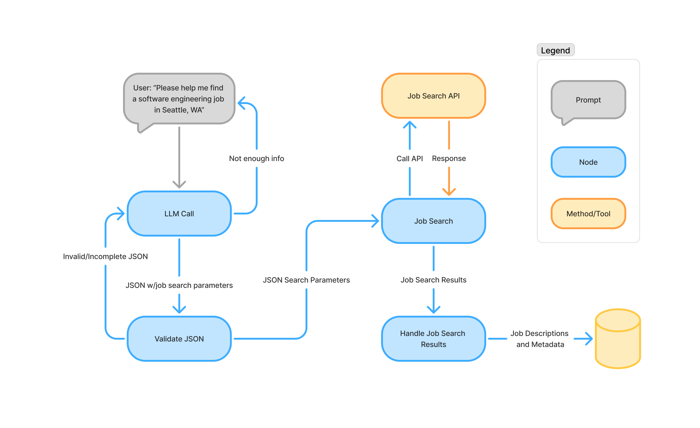

## Workflows

### Job Search Workflow

The Job Search Workflow begins with a user's prompt to find job roles with specific search parameters.  The wofklow takes the prompt, creates a JSON representation of the query, and forwards that to a job search node.  This node turns the job search parameters into an API call to a service (such as JobDataLake) which returns job descriptions related to the query.  This workflow takes these results, parses the data into various objects, and stores them (e.g. as JSON files or in a database).

